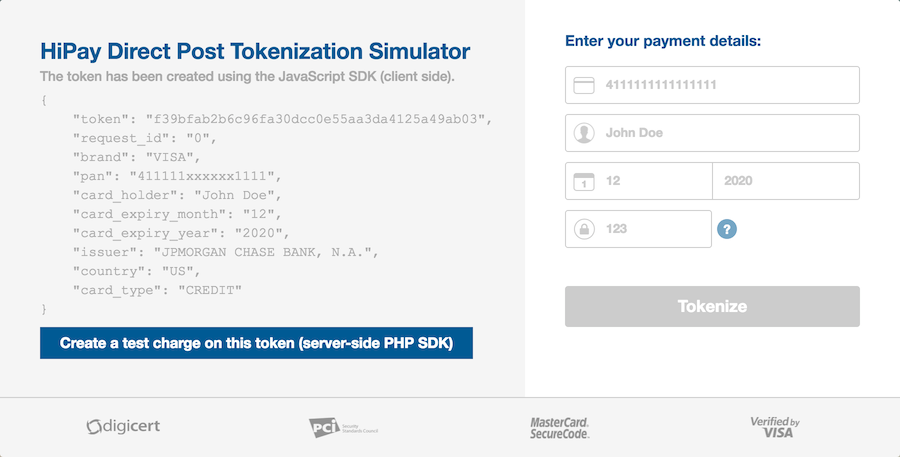

# HiPay Fullservice SDK for JavaScript 

## Direct Post Tokenization

The HiPay Fullservice SDK for JavaScript allows you to tokenize credit or debit cards against the HiPay Fullservice payment platform, directly from the web browser. This method (called Direct Post in the PCI council terminology) allows you to offer a unfied payment workflow to your customers while remaining PCI compliant.

## Getting started

Read the **[project documentation][doc-home]** for comprehensive information about the requirements, general workflow and installation procedure. You will also learn how to use the example.

## Resources
- [Full project documentation][doc-home] — To have a comprehensive understanding of the workflow and get the installation procedure
- [HiPay Support Center][hipay-help] — To get technical help from HiPay
- [Issues][project-issues] — To report issues, submit pull requests and get involved (see [Apache 2.0 License][project-license])
- [Change log][project-changelog] — To check the changes of the latest versions
- [Contributing guidelines][project-contributing] — To contribute to our source code

## Features

- Tokenization of credit and debit cards
- Can be plugged to any customized payment form owned by the merchant
- High level of security (card numbers are sent to HiPay and don't hit the merchant's server)
- Fully PCI compliant (SAQ A-EP)
- Direct Post method

## License

The **HiPay Fullservice SDK for JavaScript** is available under the **Apache 2.0 License**. Check out the [license file][project-license] for more information.

[doc-home]: https://developer.hipay.com/doc/hipay-fullservice-sdk-js/
[hipay-help]: http://help.hipay.com
[project-issues]: https://github.com/hipay/hipay-fullservice-sdk-js/issues
[project-license]: LICENSE.md
[project-changelog]: CHANGELOG.md
[project-contributing]: CONTRIBUTING.md
